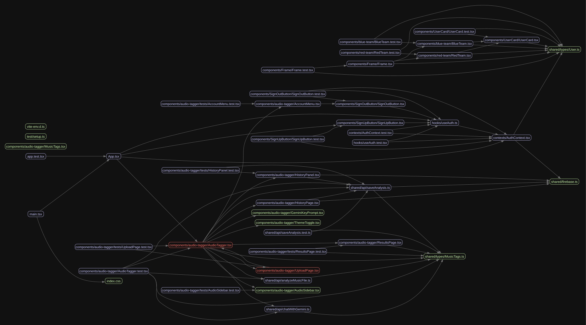

# Architecture & Code Quality Review

**Team:** Tribe-X
**Date:** June 1, 2026
**Commit reviewed:** `048fb208f4bfb113717c518b9e4ce8aaefef72c2`

---

## Architecture Diagram

### Surprises & Observations

- HistoryPage and HistoryPanel seem to be doing the same thing and we saw this once we drew the diagram; showing us some duplicated code
- There are very many components all depending on the FastAPI layer so it could be a single point of failure for the app
- Most of the components each handle one main functionality as opposed to having one big component handling the whole UI. This was good since it helped break the code into smaller more manageable pieces

---

## Architecture Questions

**Can every box be reached from some entry point? (Dead code?)**
Yes, almost every box is reachable. There is some dead code: the `Frame/`, `RedTeam/`, `BlueTeam/`, and `UserCard/` components are scaffolding left over from the initial project harness and are never imported in the actual application flow.

**Does any component talk directly to the data layer, skipping the logic layer? (Leaky abstraction.)**
Yes — `HistoryPanel` and `HistoryPage` both query Firestore directly using `onSnapshot` rather than going through a shared data service. Ideally, Firestore access would be centralized in `src/shared/api/` so components stay decoupled from the persistence layer.

**Are there two boxes doing nearly the same job? (Duplication at the architecture level.)**
Yes — `HistoryPage` and `HistoryPanel` both query the same `/analyses` Firestore collection for the same user, order by the same field, and render the same record shape. The only difference is that `HistoryPanel` caps results at 2 and lives on the upload page, while `HistoryPage` is the full-screen view. The query and rendering logic could be shared.

**Where does the auth state live? How does it get to the components that need it?**
Auth state lives in `AuthContext` (`src/contexts/AuthContext.tsx`), provided by `AuthProvider` which wraps the entire app in `App.tsx`. `AppContent` consumes it via the `useAuth()` hook and passes `displayName` and `uid` down as props to `AudioTagger`, which then passes them further to child components like `AccountMenu`, `HistoryPanel`, and `HistoryPage`.

**If Firestore went down, which screens would fail gracefully vs. crash?**

- **Graceful:** The upload and analysis flow would still work — `analyzeMusicFile()` calls the FastAPI backend, not Firestore. The results page would display normally.
- **Fails with a user-visible message:** Saving after analysis would fail and surface the `saveError` banner ("Could not save analysis — results shown locally only.").
- **Fails with an error state:** `HistoryPanel` and `HistoryPage` would hit their `onSnapshot` error handler and show "Could not load history."
- **Auth:** Firebase Auth is a separate service and would continue working independently of Firestore.

---

## Diagram vs. Reality (Top 3 Mismatches from Madge)

1. In our diagram, we initially thought each component was roughly equal to each other and all components were called from `App.tsx` — but looking at the madge diagram, many of them are actually called from `AudioTagger.tsx`, making it the true architectural center.
2. The hand-drawn diagram shows React → FastAPI as a simple HTTP fetch, implying clear separation. Madge reveals a `shared/` directory that many components depend on, meaning the boundary is less clean than it looks.
3. The madge diagram showed us that the initial code from our first spike was still connected to our current code through `User.ts`, meaning dead-code types are still being imported and compiled.

---

## Bus Factor Overlay

Annotated diagram: `docs/architecture-bus-factor.png`

- **Pink files (concentrated ownership):** 45
- **Pink files that are also hotspots** (large or frequently edited): `UploadPage.tsx`, `AccountMenu.tsx`, `HistoryPanel.tsx`, `index.css`, `ResultsPage.test.tsx`, `MusicTags.ts`
- **Pink files that are also architectural centers** (many other files import them): `HistoryPage.tsx`, `ResultsPage.tsx`, `AudioTagger.tsx`, `MusicTags.ts`

**Biggest single-person dependency:** If the primary author of `AudioTagger.tsx` is unavailable, we cannot safely modify the core upload-analyze-save-chat flow without risking regressions across the entire application.

---

## Top 5 Findings

| #   | Finding                                                               | File(s)                                            | Severity    | Bus Factor                    | Why it matters                                                                                                                                               |
| --- | --------------------------------------------------------------------- | -------------------------------------------------- | ----------- | ----------------------------- | ------------------------------------------------------------------------------------------------------------------------------------------------------------ |
| 1   | Main app workflow is concentrated in one component                    | `AudioTagger.tsx`                                  | High        | Low — many authors touched it | Upload, analysis, chat, history, saving, and view state all depend on one hot file, so small changes can break the whole flow.                               |
| 2   | Backend analysis API is a single choke point                          | `backend/api.py`                                   | High        | Medium — 3 main authors       | File upload, Gemini calls, prompt/schema logic, and API routes are bundled together; if it fails, both analysis and chat fail.                               |
| 3   | Frontend/backend/tag data contracts are duplicated                    | `MusicTags.ts`, `api.py`, `saveAnalysis.ts`        | High        | Medium                        | Tag shapes are defined in multiple places and frontend responses are cast without runtime validation, so schema drift can silently break results or history. |
| 4   | Results page is too large and mixed-purpose                           | `ResultsPage.tsx`                                  | Medium-High | Medium — 5 authors            | Exporting, editing, chat, suggested tags, tabs, and display logic live together, making UI regressions likely as features change.                            |
| 5   | Persistence/security behavior lacks emulator proof and docs are stale | `firestore.rules`, `testing.md`, `architecture.md` | Medium      | High — mostly 1-2 authors     | User history privacy depends on Firestore rules, but the story checklist still calls for emulator verification; stale docs also mislead future AI/code work. |

---

## Tool Output Summary

- **jscpd:** 20 duplicated blocks; the largest duplicated block has 24 lines
- **madge:** 1 circular dependency — `components/audio-tagger/AudioTagger.tsx` → `components/audio-tagger/UploadPage.tsx`
- **Largest files:**
  1. `ResultsPage.tsx` — 879 lines
  2. `AudioTagger.tsx` — 355 lines
  3. `HistoryPage.tsx` — 144 lines
- **Unused exports:** 5 total — most are part of the initial architectural spike; only one unused export exists in the main project code

---

## What We'd Fix First, and Why

We would remove all dead code (the legacy `Frame/`, `RedTeam/`, `BlueTeam/`, `UserCard/` components) and reduce the duplicated lines identified by jscpd — this has the lowest risk and immediately reduces confusion for future contributors. Our next step would be to consolidate `HistoryPanel` and `HistoryPage` into a shared data hook so Firestore is not queried in two places. Finally, we would add a runtime schema validation layer (e.g. Zod) at the API boundary so tag shape mismatches between the Python backend and TypeScript frontend are caught immediately rather than silently corrupting saved data.

---

## Lessons for the Next Project

Each phrased as "Next time, we will \_\_\_":

1. **Next time, we will** run `jscpd` more frequently throughout the sprint — not just at the end — so duplicated code is caught and removed before it accumulates.
2. **Next time, we will** require tests as part of the PR definition of done, so coverage grows incrementally rather than being retrofitted.
3. **Next time, we will** run `madge` with the full team at the start of each sprint so everyone has an accurate shared mental model of the system before making changes.
