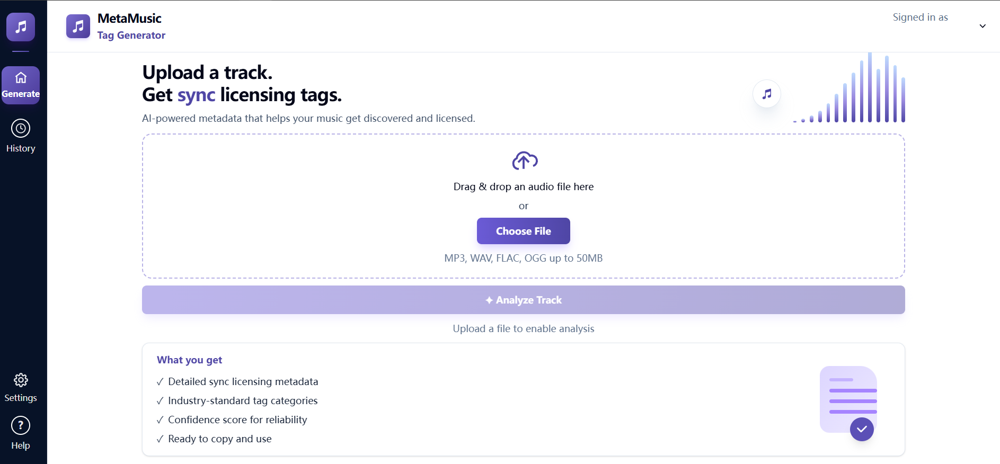

# MetaMusic Tag Generator

## Project Overview

MetaMusic Tag Generator is an AI-powered web application built for Robert Bismuth (Solo Hands Music LLC) that automates sync licensing metadata for music tracks. A user uploads an audio file, and the app analyzes it using audio feature extraction and Google's Gemini AI to generate industry-standard Disco sync licensing tags — genre, mood, instruments, vocals, tempo, lyric themes, and artist references.

This saves musicians and music supervisors hours of manual tagging work, making tracks more discoverable on sync licensing platforms.



**Key features:**

- Upload MP3, WAV, FLAC, OGG, M4A, or AIFF files (up to 50MB)
- AI-generated Disco sync licensing tags with confidence score
- Chat-based tag refinement — describe what you want changed, AI suggests revisions
- Editable tags — double-click any tag to edit, add, or remove
- Export tags as CSV or copy to clipboard
- Analysis history saved to your account
- Light/dark theme

---

## Application Link

**Live app:** [https://tribe-x.web.app](https://tribe-x.web.app)

**To use the app:**

1. Click **Sign in with Google** — any Google account works
2. On first load, you will be prompted to enter a **Gemini API key**
   - Get a free key at [aistudio.google.com/apikey](https://aistudio.google.com/apikey)
   - The key is stored only in your browser (localStorage) and is never saved to our servers
3. Upload an audio track and click **Analyze Track**

> The Gemini API key is required for every analysis and chat session. It is sent directly from your browser to our backend with each request and is not stored anywhere server-side.

---

## Project Management

**Backlog:** [GitHub Project Board](https://github.com/orgs/NUCS394-S2026-2/projects/5)

The team used GitHub Projects as the primary project management tool. We swarmed together to generate user stories at the start of the project and added them to the backlog. Stories were prioritized, assigned to sprints, and moved across columns (Backlog → In Progress → Done) as work was completed. Each story had a corresponding spec file in `docs/agent/stories/` that defined acceptance criteria and technical approach before any code was written.

---

## Build & Deployment

### Prerequisites

- Node.js `22+` and npm `10+`
- Python `3.9+` (macOS or Linux — see note below)
- A Firebase project with Auth, Firestore, and Storage enabled
- A Google Gemini API key (per user — see Application Link section)

> **Windows users:** The backend uses `essentia`, which only has pre-built wheels for macOS and Linux. Use [WSL](https://learn.microsoft.com/en-us/windows/wsl/) on Windows.

---

### Running Locally

You need **two terminals** running simultaneously — one for the frontend, one for the backend.

#### 1. Environment variables

Copy the example env file and fill in your Firebase config values:

```bash
cp env.example .env
```

Required values in `.env`:

```
VITE_FIREBASE_API_KEY=
VITE_FIREBASE_AUTH_DOMAIN=
VITE_FIREBASE_PROJECT_ID=
VITE_FIREBASE_STORAGE_BUCKET=
VITE_FIREBASE_MESSAGING_SENDER_ID=
VITE_FIREBASE_APP_ID=
VITE_ANALYSIS_API_URL=http://localhost:8000
```

#### 2. Frontend

```bash
npm install
npm run dev
```

The app runs at `http://localhost:5173`.

#### 3. Backend (Python analysis server)

```bash
cd backend
python -m venv venv
source venv/bin/activate        # Windows (WSL): venv\Scripts\activate
pip install -r requirements.txt
uvicorn api:app --reload --port 8000
```

The backend runs at `http://localhost:8000`. The frontend talks to it via `VITE_ANALYSIS_API_URL`.

---

### Deploying to Production

#### Frontend — Firebase Hosting

The frontend is deployed to Firebase Hosting at [tribe-x.web.app](https://tribe-x.web.app).

```bash
npm run build
firebase deploy --only hosting
```

You will need the Firebase CLI installed (`npm install -g firebase-tools`) and to be logged in (`firebase login`).

#### Backend — Render

The Python backend is deployed on [Render](https://render.com) using the configuration in `render.yaml`. Deployment is triggered automatically on pushes to `main`. (Corey to edit)

---

### Available Scripts

| Command                 | Description                             |
| ----------------------- | --------------------------------------- |
| `npm run dev`           | Start Vite dev server                   |
| `npm run build`         | TypeScript compile + production build   |
| `npm run lint`          | Prettier + ESLint across the repo       |
| `npm test`              | Vitest in watch mode                    |
| `npm test -- --run`     | Vitest suite once, no watch             |
| `npm run test:coverage` | Vitest with V8 coverage report          |
| `npm run type-check`    | TypeScript check without emitting files |

**Before any PR, run all three:**

```bash
npm run lint && npm test -- --run && npm run build
```

---

## Additional Information

### Architecture

The app has three layers:

1. **React SPA (frontend)** — TypeScript + Tailwind, deployed on Firebase Hosting. Handles UI, file validation, tag editing, and calls to both the backend API and Firebase directly.
2. **Python FastAPI backend** — deployed on Render. Receives audio files, runs Essentia + librosa feature extraction, then calls Gemini AI to generate tags. Also handles the chat refinement endpoint.
3. **Firebase (GCP)** — Firebase Auth (Google OAuth), Firestore (analysis history, user profiles), and Firebase Storage (audio files). The frontend talks to Firebase directly via the Firebase SDK — no backend proxy.

Full architecture breakdown: [`ARCHITECTURE_REVIEW.md`](ARCHITECTURE_REVIEW.md)

### Coding Standards

- TypeScript strict mode is on — no `any` or `@ts-ignore` without an ADR
- ESLint 9 flat config + Prettier enforced via pre-commit hook (Husky + lint-staged)
- Firestore is the source of truth — no duplicating Firestore data in local state without caching intent
- All new features require a story spec in `docs/agent/stories/` before code is written

### Docs Overview

| Folder                                             | Purpose                                                      |
| -------------------------------------------------- | ------------------------------------------------------------ |
| [`docs/tribe/`](docs/tribe/)                       | Team practices, client info, branching/naming conventions    |
| [`docs/agent/`](docs/agent/)                       | Architecture, design, testing, data model, story specs, ADRs |
| [`docs/harness.md`](docs/harness.md)               | Registry of every guide and sensor in the repo               |
| [`ARCHITECTURE_REVIEW.md`](ARCHITECTURE_REVIEW.md) | Full code quality and architecture review with findings      |

---

## Link to Docs

- [Architecture Guide](docs/agent/architecture.md)
- [Data Model](docs/agent/data-model.md)
- [Design Guide](docs/agent/design.md)
- [Testing Guide](docs/agent/testing.md)
- [Architecture & Code Quality Review](ARCHITECTURE_REVIEW.md)
- [Product Vision](docs/tribe/Product-Vision.md)
- [Project Backlog](https://github.com/orgs/NUCS394-S2026-2/projects/5)
- [Development Practices](docs/tribe/Development-Practices.md)
- [Branching & Merging](docs/tribe/Approaches-to-Branching-and-Merging.md)
